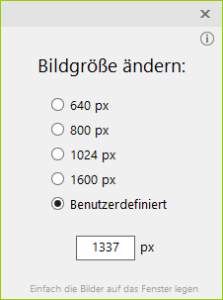

# Picimize
### Kleines Tool um sehr einfach (viele) Bilder zu verkleinern

Immer wieder muss man (oder ich) Bilder kleiner machen, damit sie z. B. auf Webseiten nicht so viel Platz verbrauchen.
Nutzer, speziell auf Mobilgeräten, verbrauchen auch gleichzeitig nicht unnötig ihr Datenvolumen und Ladezeiten werden verkürzt.

Das kleine Picimize öffnet sich und alles was man machen muss, ist die richtige Größe einzustellen und die zu verändernden Bilder auf das Fenster zu legen.
Picimize erzeugt nun automatisch einen Ordner mit der eingestellten Pixelgröße (für "640 px" heißt der Ordner "#640") und legt die verkleinerten Bilder in diesen neuen Ordner.

